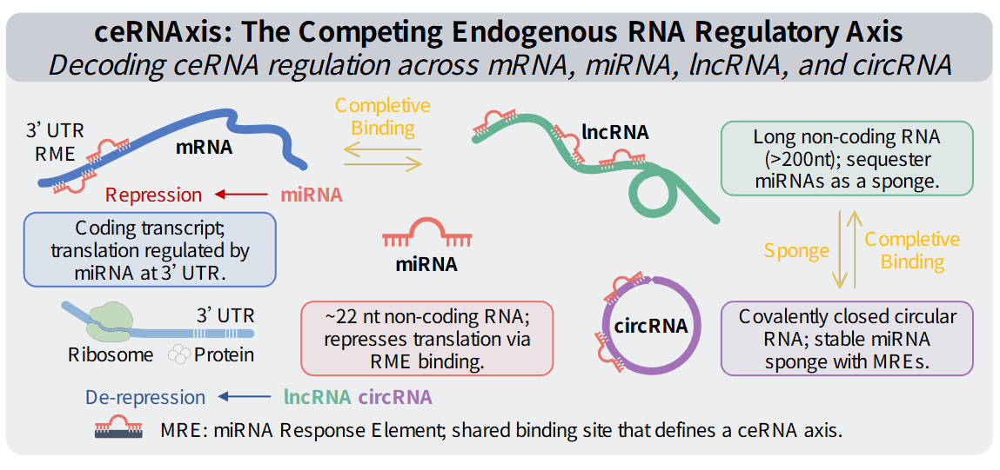
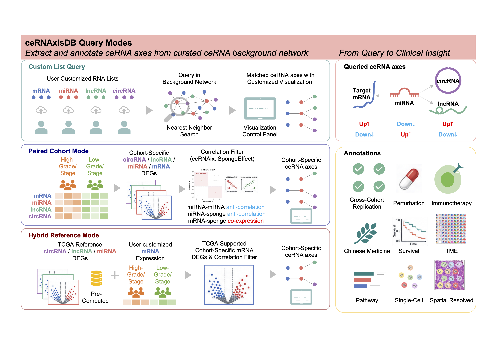

# Welcome to ceRNAxisDB

**ceRNAxisDB** is an online database and analysis platform for exploring RNA expression profiles and ceRNA regulatory axes across cancer datasets. It integrates multi-type RNA expression data, curated RNA-RNA interaction records, ceRNA axis annotations, and interactive visualization modules.

## Database

ceRNAxisDB provides a comprehensive web-based database for browsing cancer-related RNA expression datasets and ceRNA interaction networks. The database contains four RNA expression resources, including **mRNA**, **miRNA**, **lncRNA**, and **circRNA** expression databases. Each RNA type is organized as an independent dataset list, where you can search, filter, and access dataset-level information, sample metadata, expression files, expression matrices, and visualization panels.

In addition to expression datasets, ceRNAxisDB provides a **ceRNA Axis Interaction Network Database**, which collects curated RNA-RNA interaction records from multiple public resources. These interactions include miRNA-mRNA, miRNA-lncRNA, and related ceRNA regulatory relationships, serving as the background catalogue for ceRNA axis construction and annotation.

## Analysis Workflows

ceRNAxisDB further provides three integrated analysis workflows, enabling users to move from simple querying to full ceRNA network construction:

- **Custom List Query (Module 1)**: retrieve curated ceRNA axes using a user-defined RNA list
- **Paired Cohort Mode (Module 2)**: perform differential expression analysis and de novo ceRNA axis construction using case–control expression data
- **Hybrid Reference Mode (Module 3)**: integrate user data with TCGA reference profiles for reference-aware ceRNA analysis

These workflows are tightly connected with the database resources, enabling seamless transition from data browsing to functional ceRNA network analysis.

