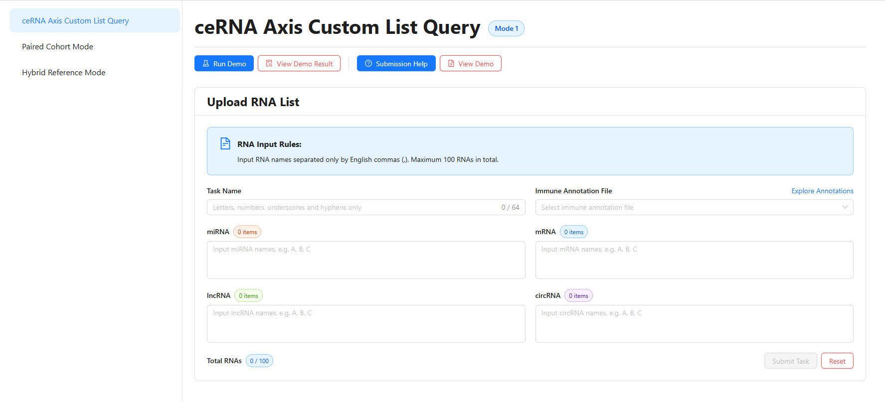
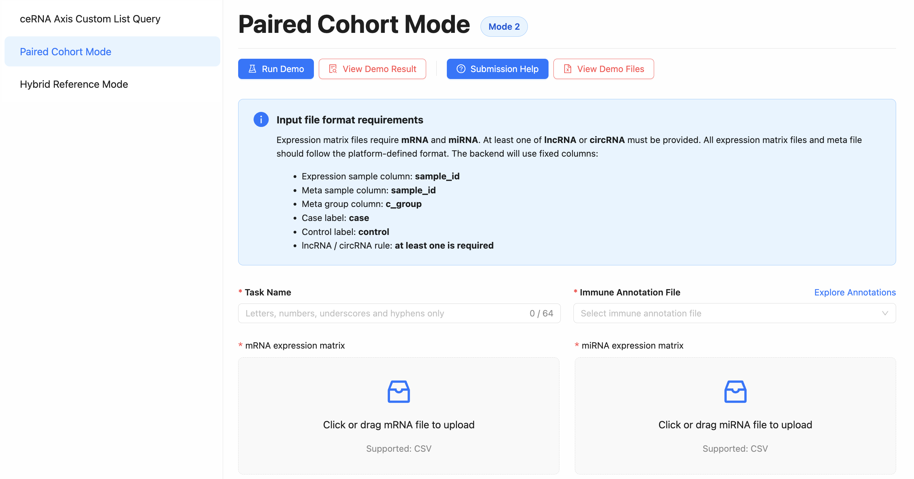
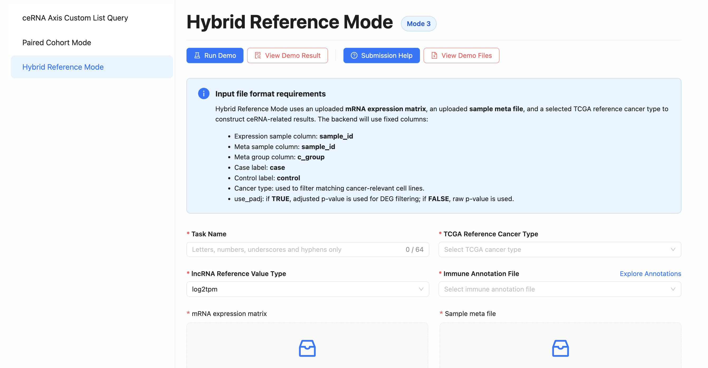

# Workflow

The **ceRNAxisDB workflow system** provides three complementary analysis modes for exploring ceRNA regulatory mechanisms across cancer datasets. These workflows range from simple ceRNA axis querying to full transcriptome-based differential expression and reference-integrated analysis.

## Module 1 ：ceRNA Axis Custom List Query

This module allows you to input a custom list of RNAs \(lncRNAs, miRNAs, mRNAs, or circRNAs\) of interest\. The system will automatically query our comprehensive background catalogue to identify curated ceRNA axes involving your candidates and provide detailed functional annotations\.

**Input Overview**

You need to provide a **Task Name**, select an **Immune Annotation File**, and enter RNA names in the corresponding RNA input boxes\.

- **Task Name**: enter a name for your query task\.

- **Immune Annotation File**: select an annotation file for downstream immune\-related annotation\.

- **miRNA / mRNA / lncRNA / circRNA**: paste your RNAs into one or more RNA input boxes\.

RNA names should be separated only by English commas\. You can submit up to **100 RNAs** in total\.

## Module 2：Paired Cohort Mode

The **Mode 2 workflow** allows you to perform ceRNA axis analysis using your own expression data. You can upload matched case–control cohorts and generate differential expression results, ceRNA regulatory axes, and downstream functional annotations in one integrated pipeline.

**Input Overview**

To run the workflow, you need to upload expression matrices and a sample metadata file.

- **mRNA expression matrix (required)**: gene expression values for protein-coding genes
- **miRNA expression matrix (required)**: miRNA expression profiles
- **lncRNA or circRNA expression matrix (one required)**: at least one must be provided
- **Sample meta file (required)**: contains sample annotations and group labels

The meta file must include:

- `sample_id`: matching the expression matrix
- `c_group`: sample group label (`case` or `control`)

You must define two groups in the metadata file:

- **case**: disease or experimental group
- **control**: control or normal group

The workflow uses these labels to perform differential expression analysis.

Differential Expression Settings：

The workflow uses **limma** as the default DEG method. You can adjust filtering thresholds for each RNA type:

- log2FC cutoff (mRNA / miRNA / lncRNA / circRNA)
- p-value or adjusted p-value cutoff
- option to use adjusted p-values

These parameters are used to identify significantly differentially expressed RNAs.

## Module 3: Hybrid Reference Mode

The **Hybrid Reference Mode** allows you to perform ceRNA analysis by combining your uploaded expression data with a selected TCGA reference cancer type. You can upload an mRNA expression matrix and sample metadata, and the system will integrate them with reference cancer profiles to generate differential expression results and ceRNA regulatory axes.

**Input Overview**

To run the workflow, you need to upload expression data, sample metadata, and configure analysis parameters.

Required Inputs

- **mRNA expression matrix (required)**: gene expression values for mRNAs
- **Sample meta file (required)**: sample annotations including group labels
- **TCGA reference cancer type (required)**: used to define reference background for comparison

The system uses fixed column requirements:

- Expression matrix sample column: `sample_id`
- Meta sample column: `sample_id`
- Meta group column: `c_group`
- Case label: `case`
- Control label: `control`

Optional RNA Input

- **lncRNA / circRNA reference value type**: select expression scale such as `log2tpm`

All uploaded files must follow the platform-defined format. The workflow requires properly matched sample IDs between expression and metadata files to ensure correct integration with the reference dataset.

Advanced Settings

You can configure differential expression analysis parameters:

- **DEG method**: currently supports `limma`
- **Use adjusted p-value**: choose whether to use adjusted p-values for filtering
- **log2FC cutoff (mRNA / lncRNA / circRNA)**: defines expression change threshold
- **p-value cutoff (mRNA / lncRNA / circRNA)**: defines statistical significance threshold
- **TCGA reference cancer type**: used to align your data with a reference cancer background

## Output Overview 

After submitting an analysis task, users can click `Workspace` on the navigation bar to monitor its progress\. User can paste task uuid in uuid input box to query task status\. Once task finished, user can click `View Task Detail` to check the result page

## Output Visualization  

Similar to the Annotation page in mRNA datasets, the result page for each task in **ceRNAxisDB** generates a series of interactive visualization modules based on the selected workflow. These visual outputs dynamically reflect the ceRNA analysis results derived from the uploaded RNA lists or reference-based computations.

The visualization components include the **ceRNA interaction network**, which displays regulatory relationships among miRNAs, mRNAs, lncRNAs, and circRNAs, as well as immune-related annotations such as immune-associated nodes and edges. Users can interactively search RNAs, adjust network views, and explore regulatory connectivity patterns.

In addition, the result page provides structured summaries of detected ceRNA axes and associated interaction evidence, enabling systematic exploration of RNA–RNA regulatory relationships across the queried dataset.

